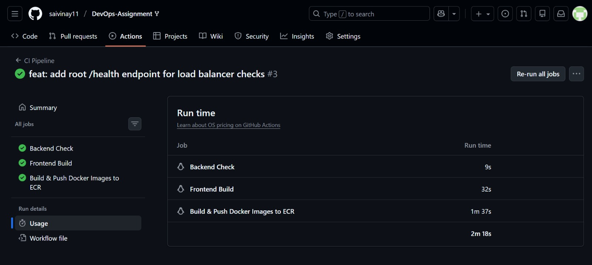
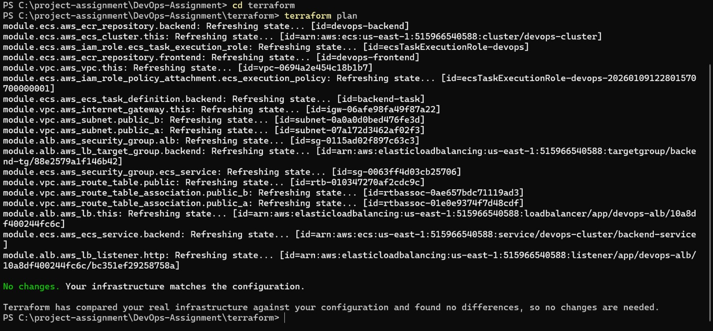
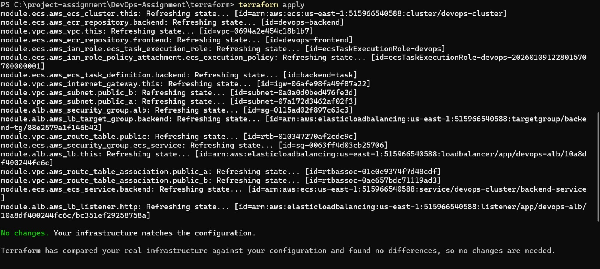
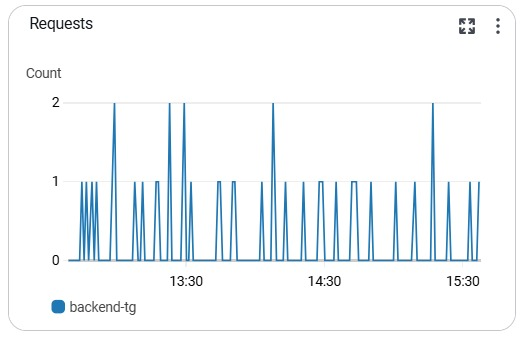
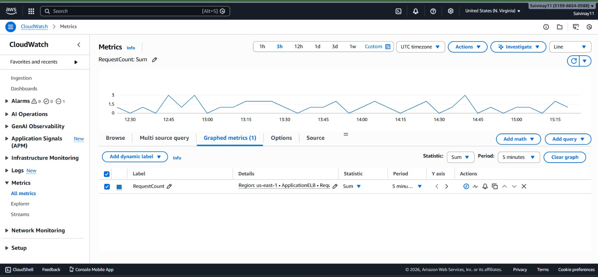

# DevOps Assignment – Two-Tier Web Application

This repository contains a production-grade DevOps implementation of a two-tier application consisting of:
- **FastAPI backend**
- **Next.js frontend**

The project demonstrates end-to-end DevOps practices including containerization, CI/CD automation, Infrastructure as Code (Terraform), monitoring, security, and load balancing across **AWS and GCP**.

---

## 🧱 Architecture Overview

- Frontend: Next.js (containerized)
- Backend: FastAPI (containerized)
- CI/CD: GitHub Actions
- Infrastructure: Terraform
- AWS Services:
  - VPC
  - ECS (Fargate)
  - Application Load Balancer
  - ECR
  - CloudWatch
- GCP Services:
  - Cloud Run
  - Artifact Registry
- Load Balancing: AWS ALB
- Monitoring: AWS CloudWatch

---

## 🔀 Git Workflow

- `main` – production-ready branch
- `develop` – integration branch
- Feature-based commits with meaningful messages
- CI pipeline triggered on push to `develop`

---

## 🐳 Docker & Containerization

- Multi-stage Dockerfiles for backend and frontend
- Small image size
- Non-root execution
- Environment-based configuration
- Docker Compose used for local development

---

## 🚀 CI/CD Pipeline (GitHub Actions)

On every push to `develop`:
- Backend validation
- Frontend build
- Docker image build
- Docker images pushed to AWS ECR

### CI Pipeline Evidence

---

## 🏗 Infrastructure as Code (Terraform)

All AWS infrastructure was provisioned **only using Terraform**.

### Terraform Plan

### Terraform Apply

Provisioned resources include:
- Custom VPC with public subnets
- Internet Gateway & route tables
- Application Load Balancer
- ECS Cluster & Services
- IAM roles with least privilege
- Security Groups

---

## ⚖️ Load Balancing & High Availability

- Backend runs with **multiple ECS tasks**
- Traffic distributed via Application Load Balancer
- Service remains available even if one task stops

### ALB Target Group & Traffic Distribution

---

## 📊 Monitoring & Observability

AWS CloudWatch is used to monitor:
- Request count
- Active connections
- HTTP response codes
- Target response time

### CloudWatch Metrics Dashboard

---

## 🔐 Security & IAM

- Least-privilege IAM roles
- No secrets committed to Git
- Container registry access via IAM
- Network access restricted via security groups

---

## 🌐 Live Endpoints

### AWS
- Backend (ALB):  
  `http://devops-alb-979822109.us-east-1.elb.amazonaws.com/api/health`

### GCP
- Backend (Cloud Run):  
  `https://devops-backend-528010041452.us-central1.run.app/api/health`

---

## 📦 Deliverables Checklist

- [x] Source code
- [x] Dockerfiles
- [x] Terraform configurations
- [x] CI/CD workflows
- [x] Monitoring dashboards
- [x] Load balancing validation
- [x] Multi-cloud deployment (AWS + GCP)

---

## 🎥 Demo Video

A 5–8 minute demo video explains:
- Architecture
- Git workflow
- Dockerization
- CI/CD pipeline
- Terraform provisioning
- Monitoring & load balancing

